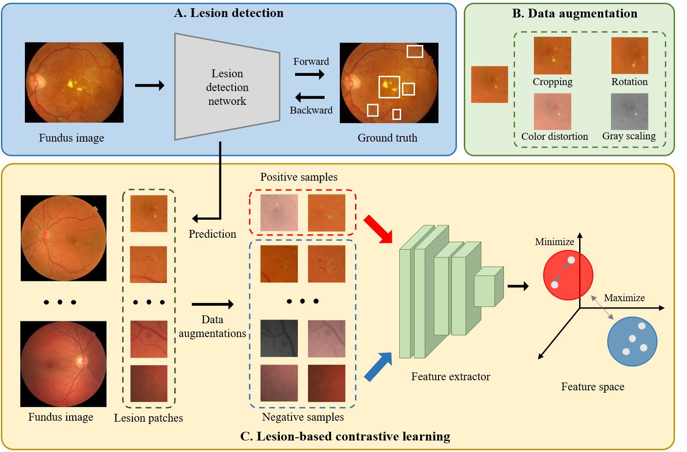

# Lesion-based Contrastive Learning

This is the official pytorch implementation of the paper:

> Yijin Huang, Li Lin, Pujin Cheng, Junyan Lyu, Xiaoying Tang. Lesion-based Contrastive Learning for Diabetic Retinopathy Grading from Fundus Images. MICCAI 2021 [[preprint](https://arxiv.org/abs/2107.08274)].




## Dataset

Two publicly-accessible datasets are used in this work.

- IDRiD for training lesion detection network [[link](https://idrid.grand-challenge.org)].
- EyePACS for contrastive learning and evaluation [[link](https://www.kaggle.com/c/diabetic-retinopathy-detection/data)].


## Usage

### Lesion detection network

A wonderful object detection toolbox [MMDetection](https://github.com/open-mmlab/mmdetection) are used for lesion detection. A trained model and predicted results can be downloaded [here](https://github.com/YijinHuang/Lesion-based-Contrastive-Learning/releases/tag/v1.0). Note that the model has a relatively poor generalization ability and cannot precisely predict lesions of fundus images from EyePACS because of the limited training samples of IDRiD. If you want to train your own detection model, please follow the instruction [here](./detection/README.md).


### Lesion-based Contrastive Learning

#### Installation

Recommended environment:

- python 3.8+
- pytorch 1.5.1
- torchvision 0.6.0
- tensorboard 2.2.1
- tqdm

To install the dependencies, run:

```shell
$ git clone https://github.com/YijinHuang/Lesion-based-Contrastive-Learning.git
$ cd Lesion-based-Contrastive-Learning
$ pip install -r requirements.txt
```

#### Build Dataset

1. Download EyePACS dataset. Then use `tools/crop.py` to remove the black border of images and resize them to 512 x 512.
2. Rename all images as 'id_eyeSide.jpeg', where 'id' here is the id of images given by EyePACS and 'eyeSide' is left or right. Then move all images into a folder.
3. Download the provided [lesion predictions](https://github.com/YijinHuang/Lesion-based-Contrastive-Learning/releases/tag/v1.0), which is a pickle file containing a dict as follows:

```python
predictions = {
    'train': {
        'id_eyeSide.jpeg': [(x1, y1, x2, y2), ..., (x1, y1, x2, y2)],
        'id_eyeSide.jpeg': [(x1, y1, x2, y2), ..., (x1, y1, x2, y2)],
        'id_eyeSide.jpeg': [(x1, y1, x2, y2), ..., (x1, y1, x2, y2)],
        ...
    },
    'val': {
        'id_eyeSide.jpeg': [(x1, y1, x2, y2), ..., (x1, y1, x2, y2)],
        'id_eyeSide.jpeg': [(x1, y1, x2, y2), ..., (x1, y1, x2, y2)],
        ...
    }
}
```

#### Training

1. Update 'data_path' and 'data_index' in `config.py`, where 'data_path' is the folder containing preprocessed images and 'data_index' is the pickle file containing lesion predicted results. You can update other training configurations and hyper-parameters in `config.py` for your customized dataset.
2. Run to train:

```shell
$ CUDA_VISIBLE_DEVICES=x python main.py
```

where 'x' is the id of your GPU. 

3. You can monitor the training progress in website [127.0.0.1:6006](127.0.0.1:6006) by running:

```shell
$ tensorborad --logdir=/path/to/your/log --port=6006
```

4. All trained models are stored in 'save_path' in `config.py`. The default path is './checkpoints'. Our final trained models on EyePACS can be downloaded [here](https://github.com/YijinHuang/Lesion-based-Contrastive-Learning/releases/tag/v1.0).

#### Evaluation

A 2D image classification framework [pytorch-classification](https://github.com/YijinHuang/pytorch-classification) is adopted to perform linear evaluation and transfer capacity evaluation. Please follow the instruction in that repository for evaluation. We do not provide the configurations for training the DR grading network because they are involved in our other paper under review. We will update it once that paper is accepted or published. The model fine-tuned on the full training set (kappa of 0.8322 on the test set) can be downloaded [here](https://github.com/YijinHuang/Lesion-based-Contrastive-Learning/releases/tag/v1.0).


## Future Plan

- [ ] Update the configurations for training the DR grading network.
- [ ] The lesion-based contrastive learning model trained on the full EyePACS dataset.
- [ ] Build dataset using better lesion detection models.


## Acknowledgment

Thanks for [SupContrast](https://github.com/HobbitLong/SupContrast) for the implementation of contrastive loss, kaggle team [o_O](https://github.com/sveitser/kaggle_diabetic) for the preprocessing code for fundus images.